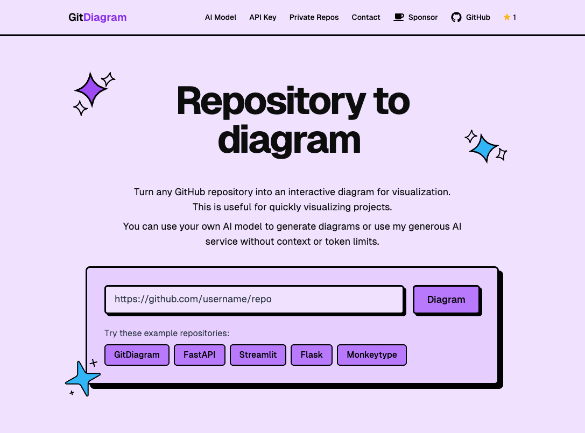

[](https://gitdiagram.com/)


[](https://ko-fi.com/ahmedkhaleel2004)

# GitDiagram

Turn any GitHub repository into an interactive diagram for visualization in seconds.

You can also replace `hub` with `diagram` in any Github URL to access its diagram.

## 🚀 Features

- 👀 **Instant Visualization**: Convert any GitHub repository structure into a system design / architecture diagram
- 🎨 **Interactivity**: Click on components to navigate directly to source files and relevant directories
- ⚡ **Fast Generation**: Powered by OpenAI GPT-5.2 (configurable) for quick and accurate diagrams
- 🖼️ **Export Options**: Copy Mermaid code or download the generated diagram as PNG
- 🌐 **API Access**: Public API available for integration (WIP)

## ⚙️ Tech Stack

- **Frontend**: Next.js, TypeScript, Tailwind CSS, ShadCN
- **Backend**: Next.js Route Handlers (Vercel Functions), Server Actions
- **Database**: PostgreSQL (with Drizzle ORM)
- **AI**: OpenAI GPT-5.2 (via `OPENAI_MODEL`)
- **Deployment**: Vercel
- **CI/CD**: GitHub Actions
- **Analytics**: PostHog, Api-Analytics

## 🔄 Backend Architecture Update

GitDiagram now runs its active backend on Next.js Route Handlers (Vercel Functions) with streaming endpoints under `/api/generate/*`.

The original FastAPI backend remains intact under `/backend` as a legacy fallback if you ever want to switch back.

## 🤔 About

I created this because I wanted to contribute to open-source projects but quickly realized their codebases are too massive for me to dig through manually, so this helps me get started - but it's definitely got many more use cases!

Given any public (or private!) GitHub repository it generates diagrams in Mermaid.js with OpenAI's GPT-5.2! (Previously Claude 3.5 Sonnet)

I extract information from the file tree and README for details and interactivity (you can click components to be taken to relevant files and directories)

Most of what you might call the "processing" of this app is done with prompt engineering and a 3-step streaming pipeline. Legacy FastAPI implementation remains under `/backend` as historical architecture/reference.

## 🔒 How to diagram private repositories

You can simply click on "Private Repos" in the header and follow the instructions by providing a GitHub personal access token with the `repo` scope.

You can also self-host this app locally (backend separated as well!) with the steps below.

## 🛠️ Self-hosting / Local Development

1. Clone the repository

```bash
git clone https://github.com/ahmedkhaleel2004/gitdiagram.git
cd gitdiagram
```

2. Install dependencies

```bash
pnpm i
```

3. Set up environment variables (create .env)

```bash
cp .env.example .env
```

Then edit the `.env` file with your OpenAI API key and optional GitHub personal access token.

4. Start local database

```bash
chmod +x start-database.sh
./start-database.sh
```

When prompted to generate a random password, input yes.
The Postgres database will start in a container at `localhost:5432`

5. Initialize the database schema

```bash
pnpm db:push
```

You can view and interact with the database using `pnpm db:studio`

6. Run Frontend (includes API backend)

```bash
pnpm dev
```

You can now access the website at `localhost:3000`.

Optional: run legacy FastAPI backend for comparison/testing:

```bash
docker-compose up --build -d
docker-compose logs -f api
```

To route frontend calls to legacy backend, set:
- `NEXT_PUBLIC_USE_LEGACY_BACKEND=true`
- `NEXT_PUBLIC_API_DEV_URL=http://localhost:8000`

For a full machine setup guide (Node/Python/uv versions + verification), see `docs/dev-setup.md`.

Quick validation:

```bash
pnpm check
pnpm test
pnpm build
```

Legacy backend docs: `docs/railway-backend.md`.

## Contributing

Contributions are welcome! Please feel free to submit a Pull Request.

## Acknowledgements

Shoutout to [Romain Courtois](https://github.com/cyclotruc)'s [Gitingest](https://gitingest.com/) for inspiration and styling

## 🤔 Future Steps

- Implement font-awesome icons in diagram
- Implement an embedded feature like star-history.com but for diagrams. The diagram could also be updated progressively as commits are made.
