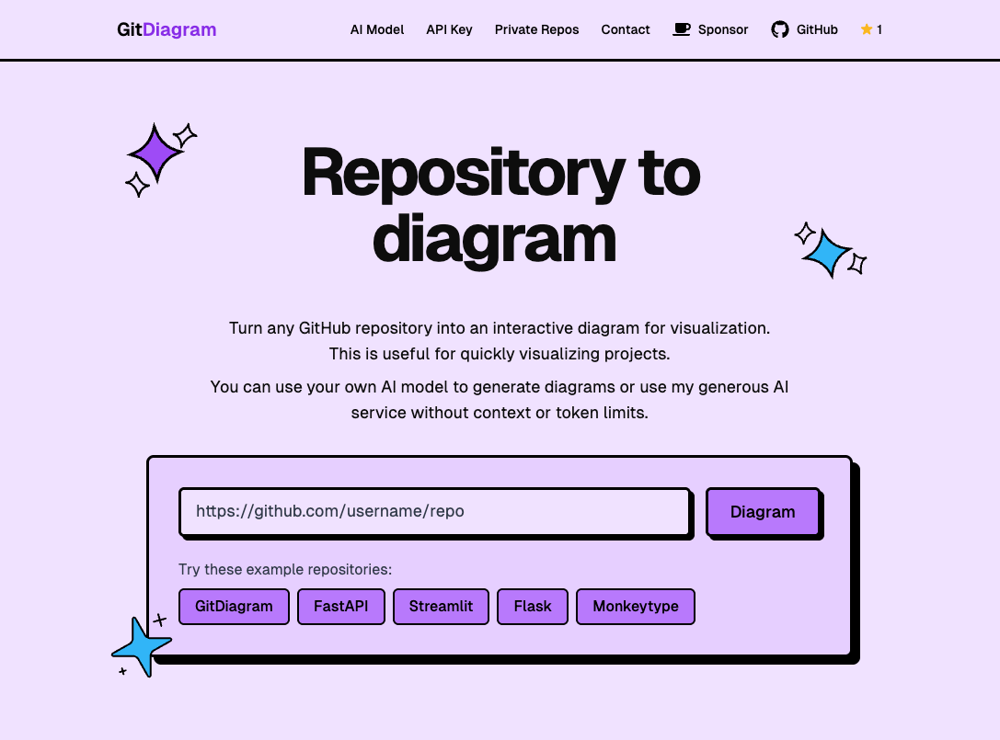
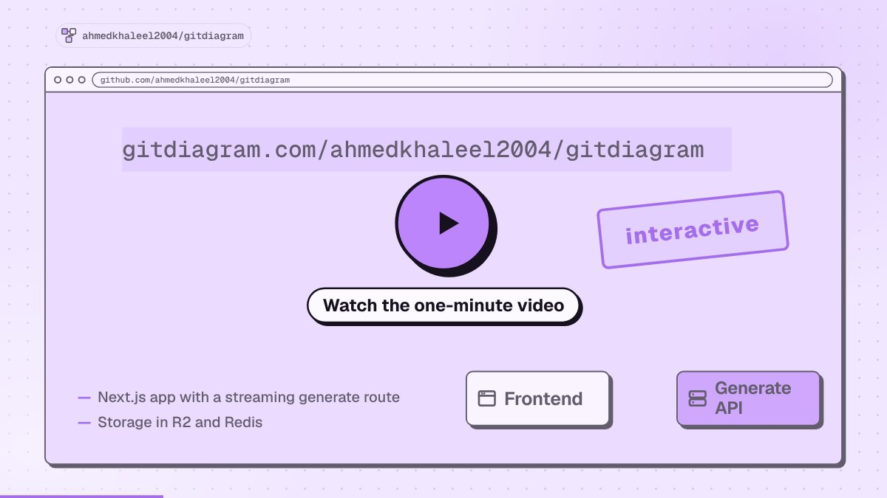

# GitDiagram

Turn any public or private GitHub repository into an interactive architecture diagram, or watch it explained in a one-minute narrated video.

**[Try GitDiagram →](https://gitdiagram.com/)** · Or replace `hub` with `diagram` in any GitHub repository URL.

[](https://gitdiagram.com/)

[](LICENSE)
[](https://ko-fi.com/ahmedkhaleel2004)

<!-- sponsor:start -->

> <a href="https://gitdiagram.com/out/sent-2026-09?placement=readme"><picture><source media="(prefers-color-scheme: dark)" srcset="./public/sponsors/sent-logo-dark.svg" /></picture></a>&nbsp;&nbsp; <sub>Sponsored</sub>
>
> SMS, WhatsApp, and RCS through one API. [Try Sent →](https://gitdiagram.com/out/sent-2026-09?placement=readme)

<!-- sponsor:end -->

## New: explainer videos

GitDiagram can now turn a repository into a narrated video of about a minute. The video tells the story from the top down: what the project does, how its main parts fit together, and a few decisions under the hood.

[](https://gitdiagram.com/ahmedkhaleel2004/gitdiagram/video)

- **[Watch the gallery →](https://gitdiagram.com/videos)** or add `/video` to any diagram URL, such as `gitdiagram.com/owner/repo/video`.
- **Download an MP4** in landscape or vertical (9:16), with captions burned in.
- **Making new videos is in early access.** Anyone can watch videos that already exist.

## Features

- **Watch a repository explained** in a narrated video, or press **Video** on any diagram page.
- **Explore the architecture** with an AI-generated diagram and streamed explanation.
- **Jump to the code** by clicking any component's linked file or directory.
- **Use private repositories** with a GitHub token via **Private Repos** in the header.
- **Export diagrams** as PNG or copy the Mermaid source.

## Run locally

Requires [Bun](https://bun.sh/), Cloudflare R2, Upstash Redis, and an OpenAI or OpenRouter API key. See the [setup guide](docs/dev-setup.md) for prerequisites and configuration.

```bash
git clone https://github.com/ahmedkhaleel2004/gitdiagram.git
cd gitdiagram
bun install
cp .env.example .env
```

Fill in `.env` using the [configuration guide](docs/dev-setup.md#configure), then start the app:

```bash
bun run dev
```

Open [localhost:3000](http://localhost:3000).

Explainer videos are off by default. To turn them on, set `VIDEO_EXPLAINER_ENABLED=1`, `NEXT_PUBLIC_VIDEO_EXPLAINER=1`, `ANTHROPIC_API_KEY`, `OPENAI_API_KEY` and `OPENROUTER_API_KEY` (for the voice) in `.env`. See `.env.example` for the other video settings.

## Development

Built with Next.js, React, TypeScript, Tailwind CSS, and Mermaid. Videos use Claude or GPT for the script and scenes and OpenRouter (Gemini 3.8 Flash TTS) for the voice. Deployed on Vercel.

- [Architecture](docs/architecture.md) — generation pipeline, storage, and API
- [Development guide](docs/dev-setup.md) — setup, checks, and deployment
- [Deployment recovery](docs/deployment-failover.md) — Railway/Docker fallback

Contributions are welcome. Open an issue or pull request with a focused description and [verification notes](docs/dev-setup.md#verify).

Inspired by [Romain Courtois](https://github.com/cyclotruc)'s [Gitingest](https://gitingest.com/).
